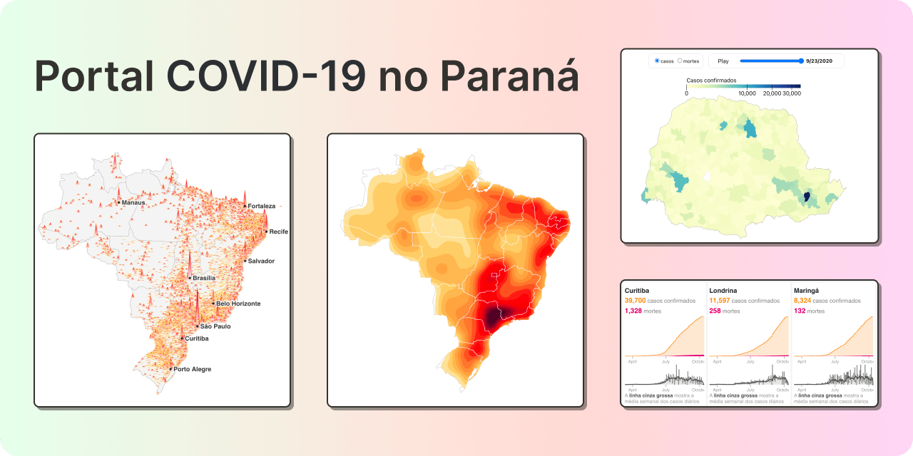

# Portal COVID-19 Paraná



[](https://opensource.org/licenses/MIT)
[](https://www.typescriptlang.org/)
[](https://nextjs.org/)
[](https://chakra-ui.com/)

O **Portal COVID-19 Paraná** reúne visualizações interativas, modelos estatísticos e dados históricos sobre a pandemia no Paraná e no Brasil. Este projeto é fruto de um esforço multidisciplinar de pesquisadores da **Universidade Federal do Paraná (UFPR)**, abrangendo os departamentos de Estatística, Informática, Física, Matemática, Design e Saúde, com apoio de parceiros externos como o Insper-SP.

## 📄 Pesquisa e Publicações

O desenvolvimento desta plataforma serviu de base para estudos em Interação Humano-Dados (HDI):

- 📘 **Systemic view of human-data interaction: analyzing a COVID-19 data visualization platform** (ACM, 2020) — [[ACM](https://dl.acm.org/doi/abs/10.1145/3424953.3426655)] [[ResearchGate](https://www.researchgate.net/publication/347919062_Systemic_view_of_human-data_interaction_analyzing_a_COVID-19_data_visualization_platform)]
- 🎤 Slides da apresentação no IHC 2020: [Analysis of a COVID-19 data visualization platform](https://www.figma.com/community/file/898618771515892178/hci-2020-analyis-of-a-covid-19-data-visualization-plataform)

> [!WARNING]
> **Status: Arquivado (2021)**
> O projeto foi concluído e arquivado em 2021. Os serviços externos de coleta de dados estão desativados e os arquivos CSV em `public/` refletem o estado final daquele período. Este repositório é mantido como registro histórico e memória do esforço técnico e científico realizado.

## 📊 Principais Funcionalidades

- **Dashboards Interativos:** Séries temporais, mapas de calor e tabelas focadas no estado do Paraná.
- **Visões Abrangentes:** Extensões para dados nacionais e globais.
- **Visualizações D3:** Componentes React com D3 e TopoJSON, sem runtime externo de notebooks.
- **Dados Históricos:** Pipeline (originalmente Brasil.IO e JHU) preservado para referência.

## 🚀 Tecnologias

- **Frontend:** Next.js, TypeScript, Chakra UI.
- **Visualização de Dados:** D3.js, TopoJSON.
- **Backend/Data Pipeline:** Python (scripts históricos em `scripts/`).

## 🛠️ Como Rodar Localmente

Certifique-se de ter o [Node.js](https://nodejs.org/) (≥ 18.18) e o [pnpm](https://pnpm.io/) instalados.

```bash
# Instalar dependências
pnpm install

# Rodar servidor de desenvolvimento (http://localhost:3000)
pnpm dev

# Build de produção
pnpm build

# Exportação estática
pnpm export
```

## 📂 Estrutura do Repositório

- `pages/` & `components/`: Interface do usuário construída com Chakra UI.
- `components/d3/`: Visualizações React+D3.
- `utils/covidData.ts`: Carregamento e normalização dos snapshots CSV/TopoJSON.
- `public/`: Ativos estáticos e snapshots de dados (CSVs).
- `scripts/`: Scripts Python utilizados historicamente para coleta e processamento (JHU, Brasil.IO).

## 🤝 Créditos e Equipe

- **UFPR:** C3SL (Centro de Computação Científica e Software Livre), LEG (Laboratório de Estatística e Geoinformação) e diversos departamentos do Setor de Ciências Exatas.
- **Dados:** Originalmente providos por [Brasil.IO](https://brasil.io/dataset/covid19/) e [covid19api.com](https://covid19api.com/).

---

Licença: [MIT](LICENSE)
